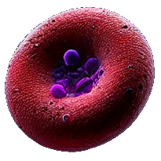
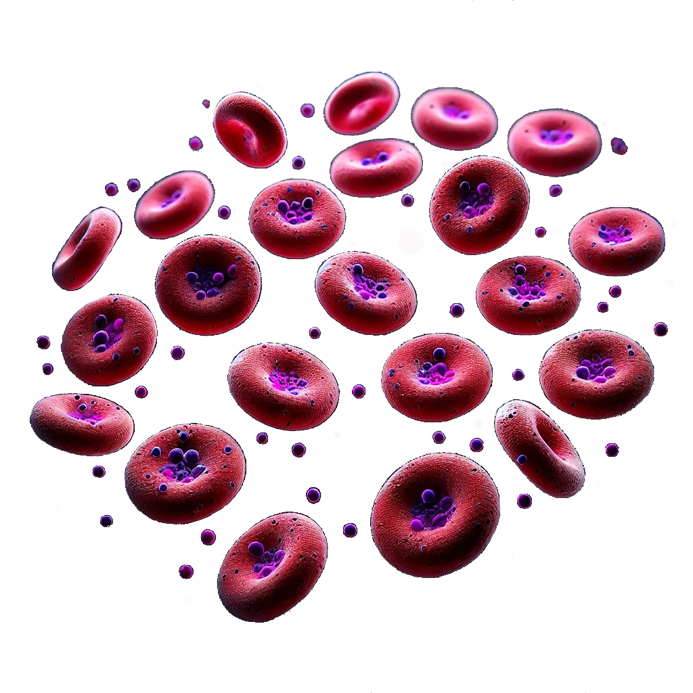
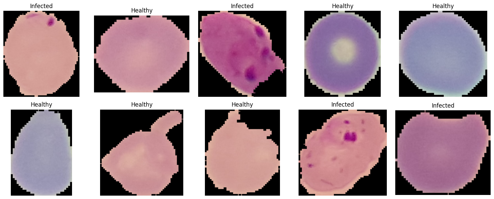
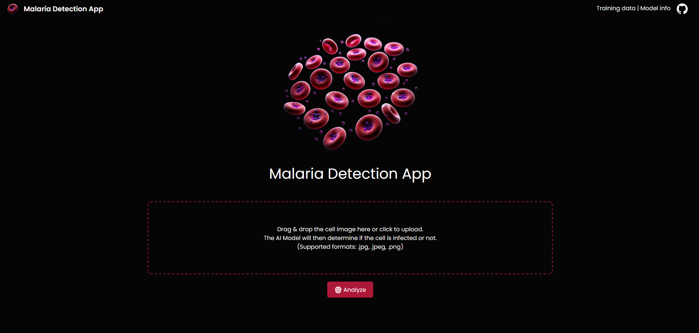
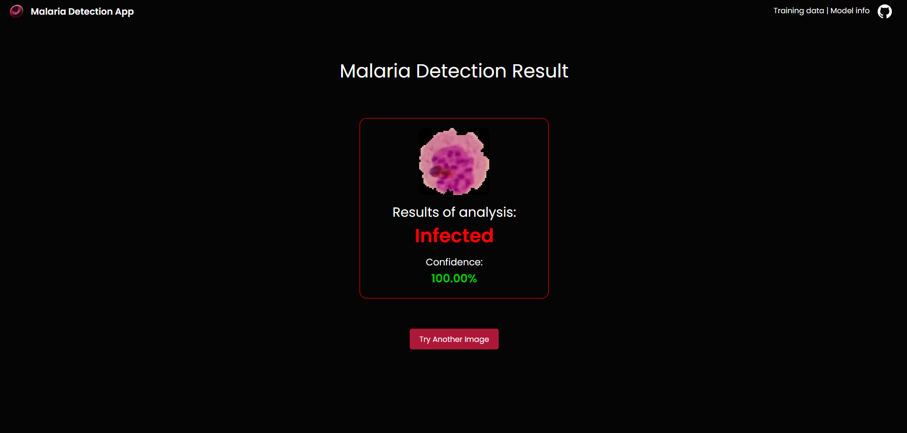
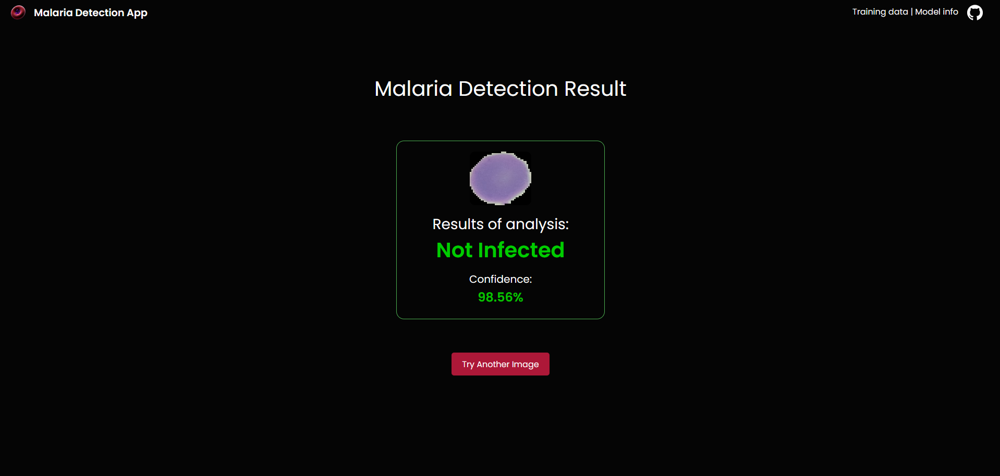

**<h1 align="center">Malaria Detection App</h1>**

<p align="center">
  <!--  -->
  
</p>

A web application that allows users to upload files for malaria detection. The app processes uploaded images or files to assist in the detection of malaria, providing a simple and user-friendly interface.

## Features
- **File Upload:** Upload images or documents for analysis.
- **Responsive Design:** Accessible on desktop and mobile devices.
- **Simple Interface:** User-friendly and easy to navigate.

## Training Data
- **Website:** https://www.tensorflow.org/datasets/catalog/malaria?hl=fr
- **Samples:**

<p align="center">
  
</p>

---

## Technologies Used
- **Backend:** [Flask](https://flask.palletsprojects.com/)
- **Frontend:** HTML, CSS, Bootstrap (for responsive design)
- **Language:** Python

---

## Prerequisites
Make sure you have the following installed:
- Python 3.8 or later
- pip (Python package installer)

---

## Installation

1. **Clone the Repository:**
   ```bash
   git clone https://github.com/TonyVallad/Malaria-Detection-App.git
   cd Malaria-Detection-App
   ```

2. **Set Up a Virtual Environment:**
   ```bash
   python -m venv .venv
   source .venv/bin/activate       # For MacOS/Linux
   .venv\Scripts\activate          # For Windows
   ```

3. **Install Dependencies:**
   ```bash
   pip install -r requirements.txt
   ```

---

<p align="center">
  
</p>

<p align="center">
  
</p>

<p align="center">
  
</p>

## Usage

1. **Run the Flask Development Server:**
   ```bash
   python app.py
   ```
   The server will start on `http://127.0.0.1:8000`.

2. **Open the Application:**
   Open your browser and navigate to:
   ```
   http://127.0.0.1:8000
   ```

3. **Upload Files:**
   - Click the "Upload" button to select and upload a file.
   - The server will process the file and display relevant information or results.

---

## Project Structure

```
Malaria-Detection-App/
│
├── src/                    # Source code folder
│   ├── modules/            # Contains Python modules for creating and training the model
│   │   └── model_create.py
│   ├── routes/             # Contains route definitions for the Flask app
│   │   └── routes.py
│   ├── static/             # Static files for the application
│   │   ├── img/            # Images used in the app
│   │   ├── model/          # Directory containing the trained model
│   │   │   └── model.keras
│   │   └── uploads/        # Directory to store uploaded files (created automatically)
│   └── templates/          # HTML templates for the application
│       ├── base.html       # Base template (top banner)
│       ├── index.html      # Landing page template
│       └── analysis.html   # Analysis results page
│
├── .gitignore              # Git ignore file
├── app.py                  # Main application entry point
├── config.py               # Application configuration settings
├── LICENSE                 # License file
├── Model_Creation.ipynb    # Jupyter notebook for model creation and testing
├── README.md               # Project documentation
└── requirements.txt        # Python dependencies
```

---

## Environment Variables

This app uses a secret key for session management. Set the following environment variable in your development or production environment:

- **`SECRET_KEY`**
  - Example:
    ```bash
    export SECRET_KEY="your_secret_key"
    ```

---

## Future Enhancements
- **Malaria Detection Algorithm Integration:** Incorporate a machine learning model to analyze uploaded images and detect malaria.

---

## Contributing

Contributions are welcome! Feel free to open issues or submit pull requests.

---

## License

This project is licensed under the MIT License. See the `LICENSE` file for more details.

---

## Acknowledgments

- [Flask Documentation](https://flask.palletsprojects.com/)
- [Bootstrap Documentation](https://getbootstrap.com/)